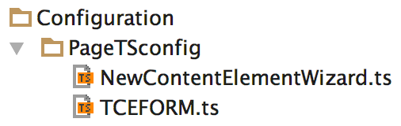

.. ==================================================
.. FOR YOUR INFORMATION
.. --------------------------------------------------
.. -*- coding: utf-8 -*- with BOM.

.. include:: ../../Includes.txt

.. _page-ts-config:

=============
Page TSconfig
=============

Page TSconfig can be found in the directory ``EXT:content_rendering_core/Configuration/TSconfig/Page/``.

- ``NewContentElementWizard.ts`` - The configuration of the "New Content Element Wizard"

- ``TCEFORM.ts`` - Disable Content Types (CType) which are not in use anymore.
  These CTypes are ``text``, ``textpic``, ``image``, ``mailform``, ``login``, ``search``, ``multimedia`` and ``media``.

   Structure of the pageTSconfig files

