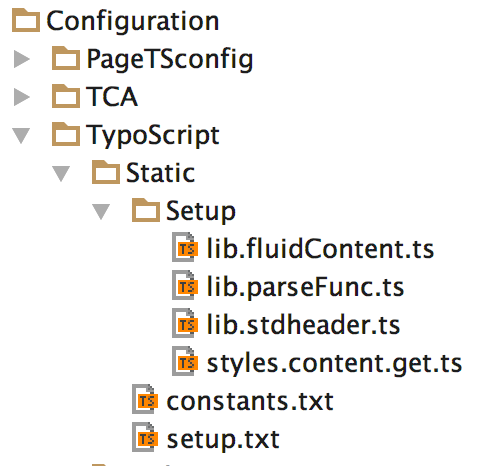

.. ==================================================
.. FOR YOUR INFORMATION
.. --------------------------------------------------
.. -*- coding: utf-8 -*- with BOM.

.. include:: ../../Includes.txt

.. _typoscript:

==========
TypoScript
==========

At the section :ref:`using-the-rendering-definitions` you've already added the static templates. Static templates are a
collection of TypoScript files. These files are located in the directory
``EXT:content_rendering_core/Configuration/TypoScript/Static/``.

   Structure of the TypoScript files

In this folder there are two files:

- ``constants.txt`` - The file with the default constants. The "Constant Editor", as described above, is using this file
  for its default settings.

- ``setup.txt`` - This file will first include some other files which are located in the "Setup" folder in the same
  directory. More about these files later. Secondly the rendering definitions of all the content elements, which belong
  to this extension, are declared. Since we have moved away from TypoScript as much as possible, these rendering
  definitions only declare the following:

  - Can FLUIDTEMPLATE be used immediately or do we need data processing in front (a processor is sometimes used to do
    some data manipulation before all the data is sent to the Fluid template).

  - Assigning the Fluid template file for each type of content element separately.

  - The configuration of the edit panel and the edit buttons for frontend editing. You need to activate the extension
    "Frontend Editing (feedit)" in the Extension Manager to see this in action.

In the folder "Setup" there are files which are included by the file setup.txt as mentioned above. These are:

- ``lib.parseFunc.ts`` - Creates persistent ParseFunc setup for non-HTML content and RTE content (which is mainly HTML)
  based on the "ts_css" transformation..

- ``lib.stdheader`` - Contains the default configuration for content elements which still use a default header (e.g. all
  Extbase CTypes, or EXT:felogin)

- ``styles.content.get`` - Contains the snippet styles.content.get, which gets the content elements located in the
  column with colPos=0, which means the regular content column.

- ``lib.fluidContent.ts`` - Default configuration for content elements using FLUIDTEMPLATE.

.. note::

   The predefined CONTENT objects styles.content.getLeft, styles.content.getRight and styles.content.getBorder are not
   provided anymore. styles.content.get still exists for your convenience. Most of the current websites are using
   "backend layouts", where the predefined numbering of the columns does not make sense. If you are still using the
   predefined CONTENT objects, you can use the following TypoScript definition:

   .. code-block:: typoscript

      styles.content {

         # get content, left
         getLeft < styles.content.get
         getLeft.select.where = colPos=1

         # get content, right
         getRight < styles.content.get
         getRight.select.where = colPos=2

         # get content, border
         getBorder < styles.content.get
         getBorder.select.where = colPos=3

         # get news
         getNews < styles.content.get
         getNews.select.pidInList = {$styles.content.getNews.newsPid}
      }

