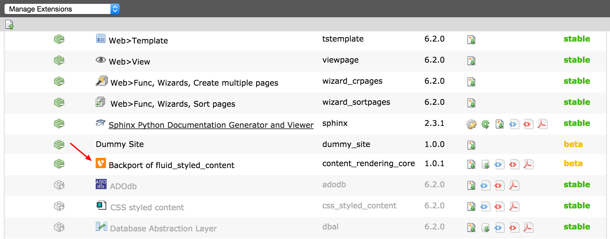

.. ==================================================
.. FOR YOUR INFORMATION
.. --------------------------------------------------
.. -*- coding: utf-8 -*- with BOM.

.. include:: ../../Includes.txt

.. _extension-manager:

=================
Extension Manager
=================

First deinstall the extension "css_styled_content" in the Extension manager, since it will conflict with
"content_rendering_core". They both are rendering the same content elements, but differently.

In the dropdown in the upper bar of the Extension Manager, select "Get Extensions". If you have not updated the
extension list previously, TYPO3 will do so.

Enter "content_core_rendering" in the search box and click the button "Go".

The extension will show up in the list below the search box.

Click the icon in front of it to install the extension.

   "content_rendering_core" installed in the Extension Manager

.. _extension-manager-configuration:

