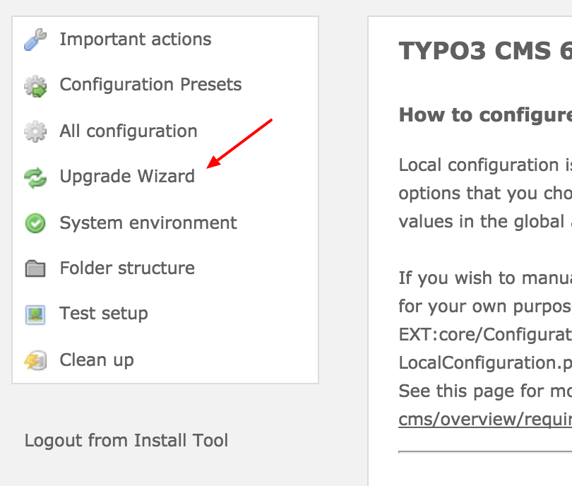

.. ==================================================
.. FOR YOUR INFORMATION
.. --------------------------------------------------
.. -*- coding: utf-8 -*- with BOM.

.. include:: ../../Includes.txt

.. _install-tool:

============
Install Tool
============

The Install tool has been designed to do major configuration of your installation, but also to check if your
installation and server environment have been properly configured.

To reach the install tool, go to the item "Install" in the module menu, which is located at the left side of your
screen. You can find it under the "System" tools. When entering the Install tool you need to provide a password to
enter it. This password has been specifically entered for the install tool itself. This is not your password to enter
the TYPO3 backend itself.

Database Analyzer
=================

When installing an extension, which needs changes in the database, the changes will be done automatically. To see if
this is done properly, you can check this by clicking the button "Compare database with current specification". If
there are any warnings that fields are missing in the tt_content table, please click the checkboxes in front of each
warning and bring the database up to date.

Upgrade Wizard
==============

Normally basic content elements, provided with the core of TYPO3 CMS, were rendered by the extension
"CSS Styled Content (css_styled_content)". Some changes have been made since moving the rendering to the extension
"content_rendering_core". Some database table (tt_content) fields have been deleted, the fields of FlexForms have been
moved to proper database fields and the content elements "Text", "Images" and "Text & Images" have been merged into a
new content element "Text & Media". To make sure you do not loose any information or the content elements look
differently on your upgraded website run these Upgrade Wizards.

The upgrade wizards can be found in the Install tool.

   Upgrade Wizard

